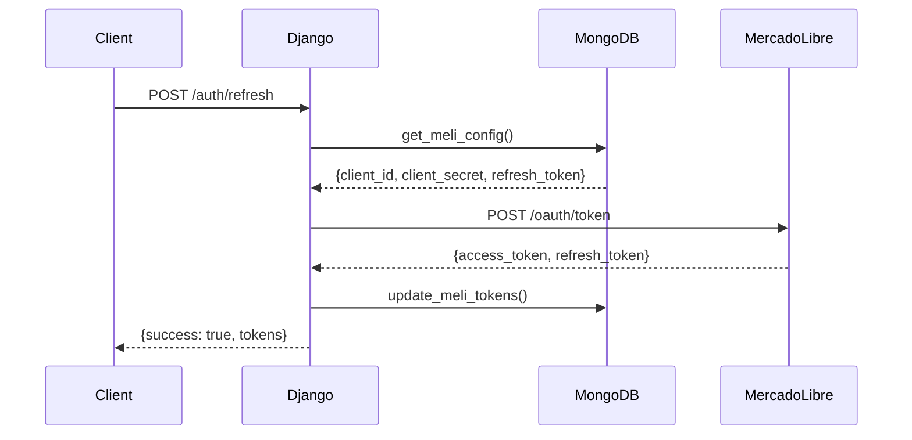
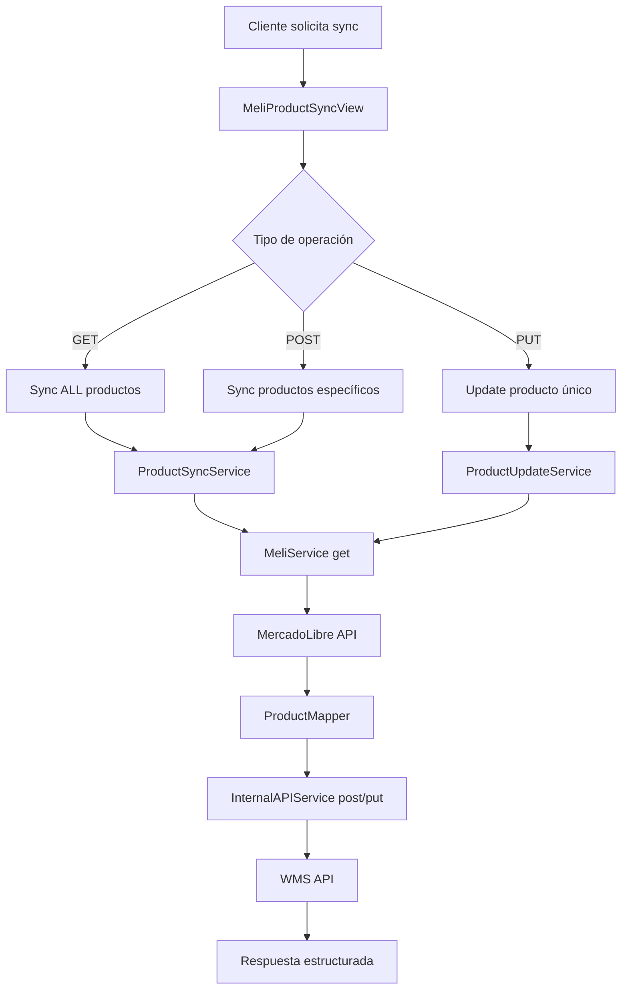
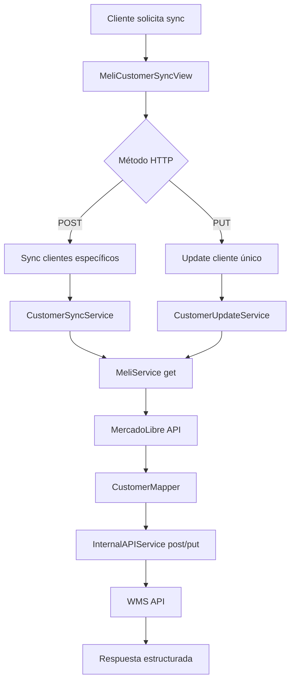

# 🛒 Sistema de Integración MercadoLibre - WMS

## 📋 Descripción General

Sistema de integración entre **MercadoLibre** y **WMS (Warehouse Management System)** construido con Django, que permite la sincronización bidireccional de productos y clientes entre ambas plataformas. El sistema maneja autenticación OAuth2, mapeo de datos, y proporciona APIs REST unificadas para operaciones CRUD.

## 🏗️ Arquitectura del Sistema

### 🔧 Tecnologías Principales
- **Backend**: Django 5.2.5 + Python 3.13
- **Base de Datos**: MongoDB (configuración centralizada)
- **APIs**: MercadoLibre API + WMS Internal API
- **Autenticación**: OAuth2 (MercadoLibre)
- **Arquitectura**: Clean Architecture + Repository Pattern

### 📁 Estructura del Proyecto

```
Integration-Proyect-SGV/
├── 🎯 mercadolibre/                 # App principal de integración
│   ├── functions/                   # Lógica de negocio
│   │   ├── Auth/                    # Manejo de autenticación
│   │   ├── Customer/                # Operaciones de clientes
│   │   └── Product/                 # Operaciones de productos
│   ├── services/                    # Servicios centralizados
│   │   ├── meli_service.py         # Cliente MercadoLibre API
│   │   └── internal_api_service.py # Cliente WMS API
│   ├── utils/                       # Utilidades
│   │   ├── mapper/                  # Mappers de datos
│   │   └── response_helpers.py      # Helpers de respuesta
│   └── views/                       # Endpoints REST
│       ├── auth.py                  # Autenticación
│       ├── customer.py              # Clientes
│       └── product.py               # Productos
├── ⚙️ project/                       # Configuración Django
│   └── config_db/                   # Servicio de configuración MongoDB
└── 📋 settings/                     # Configuraciones del sistema
```

## 🔄 Flujo de Datos Principal

### 1. 🔐 Autenticación OAuth2



### 2. 📦 Sincronización de Productos



### 3. 👥 Sincronización de Clientes



## 🗂️ Mapeo de Datos Detallado

### 📦 ProductMapper: MercadoLibre → WMS

#### Campos de Entrada (MercadoLibre)
```json
{
  "id": "MLM123456789",
  "title": "Producto Ejemplo",
  "price": 299.99,
  "available_quantity": 50,
  "condition": "new",
  "category_id": "MLM1234",
  "pictures": [{"url": "https://..."}],
  "attributes": [
    {"id": "BRAND", "value_name": "Samsung"},
    {"id": "MODEL", "value_name": "Galaxy S21"}
  ],
  "shipping": {"free_shipping": true},
  "warranty": "12 meses"
}
```

#### Campos de Salida (WMS)
```json
{
  "productoean": "MLM123456789",           // id
  "descripcion": "Producto Ejemplo",       // title
  "referencia": "MLM123456789",            // id
  "inventariable": 1,                      // fijo
  "um1": "UND",                           // fijo
  "bodega": "DEFAULT",                    // configuración
  "factor": 1.0,                         // fijo
  "estado": 1,                           // active=1, paused=0
  "preciounitario": 299.99,              // price
  "peso": 0.5,                           // calculado o fijo
  "descripcioningles": "Product Example", // traducción
  "ingredientes": "Samsung Galaxy S21",   // atributos
  "fecharegistro": "2025-09-25 20:00:00" // now()
}
```

#### 🔄 Lógica de Mapeo de Productos

```python
class ProductMapper:
    @classmethod
    def from_meli_product(cls, ml_product: Dict[str, Any]) -> "ProductMapper":
        # 1. Extracción básica
        product_id = ml_product.get("id")
        title = ml_product.get("title", "Sin título")
        price = ml_product.get("price", 0.0)
        
        # 2. Estado basado en status
        status = ml_product.get("status", "active")
        estado = 1 if status == "active" else 0
        
        # 3. Procesamiento de atributos
        attributes = ml_product.get("attributes", [])
        brand = cls._extract_attribute(attributes, "BRAND")
        model = cls._extract_attribute(attributes, "MODEL")
        ingredientes = f"{brand} {model}".strip()
        
        # 4. Peso calculado (ejemplo: basado en categoría)
        category = ml_product.get("category_id", "")
        peso = cls._calculate_weight(category, attributes)
        
        # 5. Fecha formateada para SQL Server
        fecharegistro = datetime.now().strftime("%Y-%m-%d %H:%M:%S")
        
        return cls(
            productoean=product_id,
            descripcion=title,
            referencia=product_id,
            # ... resto de campos mapeados
        )
```

### 👥 CustomerMapper: MercadoLibre → WMS

#### Campos de Entrada (MercadoLibre)
```json
{
  "id": 2702572568,
  "nickname": "TESTUSER1096697426",
  "country_id": "CO",
  "first_name": "Juan",
  "last_name": "Pérez",
  "email": "juan@email.com",
  "phone": {
    "area_code": "57",
    "number": "3001234567"
  },
  "address": {
    "city": "Bogotá",
    "state": "CO-CUN",
    "zip_code": "110111"
  },
  "identification": {
    "type": "CC",
    "number": "12345678"
  }
}
```

#### Campos de Salida (WMS)
```json
{
  "item": "2702572568",                    // id (KEY FIELD!)
  "nit": "12345678",                      // identification.number
  "nombrecliente": "Juan Pérez",          // first_name + last_name
  "direccion": "Calle 123 #45-67",       // address.address
  "codigopais": "CO",                     // country_id
  "telefono": "573001234567",             // phone.area_code + phone.number
  "cuidad": "Bogotá",                     // address.city
  "email": "juan@email.com",              // email
  "zip_code": "110111",                   // address.zip_code
  "isactivocliente": 1,                   // fijo: activo
  "fecharegistro": "2025-09-25 20:00:00"  // now()
}
```

#### 🔄 Lógica de Mapeo de Clientes

```python
class CustomerMapper:
    @classmethod
    def from_meli_customer(cls, ml_customer: Dict[str, Any]) -> "CustomerMapper":
        # 1. ID del cliente (CRÍTICO: se guarda en campo 'item')
        customer_id = str(ml_customer.get("id"))
        
        # 2. Nombre completo
        first_name = ml_customer.get("first_name", "")
        last_name = ml_customer.get("last_name", "")
        nombre_completo = f"{first_name} {last_name}".strip()
        if not nombre_completo:
            nombre_completo = ml_customer.get("nickname", "Sin nombre")
        
        # 3. Identificación
        identification = ml_customer.get("identification", {})
        nit = identification.get("number") if identification else None
        
        # 4. Teléfono concatenado
        phone_obj = ml_customer.get("phone", {})
        telefono = None
        if phone_obj and phone_obj.get("area_code") and phone_obj.get("number"):
            telefono = f"{phone_obj.get('area_code')}{phone_obj.get('number')}"
        
        # 5. Dirección
        address = ml_customer.get("address", {})
        direccion = address.get("address")
        ciudad = address.get("city")
        zip_code = address.get("zip_code")
        
        # 6. Fecha SQL Server compatible
        fecharegistro = datetime.now().strftime("%Y-%m-%d %H:%M:%S")
        
        return cls(
            item=customer_id,          # ¡CAMPO CLAVE!
            nit=nit,
            nombrecliente=nombre_completo,
            # ... resto de campos
        )
```

## 🛠️ Servicios Principales

### 🔗 MeliService - Cliente MercadoLibre API

```python
class MeliService:
    """Cliente centralizado para MercadoLibre API con refresh automático"""
    
    BASE_URL = "https://api.mercadolibre.com"
    
    def get(self, endpoint: str) -> requests.Response:
        """GET con autenticación automática"""
        
    def post(self, endpoint: str, data: Dict) -> requests.Response:
        """POST con autenticación automática"""
        
    def put(self, endpoint: str, data: Dict) -> requests.Response:
        """PUT con autenticación automática"""
        
    def _refresh_token_if_needed(self):
        """Refresh automático de tokens cuando expiran"""
```

**Características:**
- ✅ Refresh automático de tokens
- ✅ Reintentos con backoff exponencial
- ✅ Headers de autenticación automáticos
- ✅ Logging detallado de requests

### 🏢 InternalAPIService - Cliente WMS API

```python
class InternalAPIService:
    """Cliente para APIs internas del WMS"""
    
    def get(self, endpoint: str, original_request=None) -> requests.Response:
        """GET con headers de autenticación copiados"""
        
    def post(self, endpoint: str, json: Dict, original_request=None) -> requests.Response:
        """POST con datos JSON"""
        
    def put(self, endpoint: str, json: Dict, original_request=None) -> requests.Response:
        """PUT con datos JSON"""
```

**Características:**
- ✅ Propagación de headers de autenticación
- ✅ Base URL configurable
- ✅ Timeout configurable
- ✅ Logging de requests/responses

## 📍 Endpoints API

### 🔐 Autenticación
```
POST /wms/ml/v1/auth/refresh
```
**Descripción**: Refresca los tokens de MercadoLibre
**Respuesta**:
```json
{
    "success": true,
    "message": "Tokens refreshed successfully",
    "access_token": "APP_USR-xxx",
    "refresh_token": "TG-xxx",
    "expires_in": 21600,
    "token_type": "Bearer"
}
```

### 📦 Productos

#### Sincronización Completa
```
GET /wms/ml/v1/product/
```

#### Sincronización Específica
```
POST /wms/ml/v1/product/
Content-Type: application/json

{
    "product_ids": ["MLM123", "MLM456"],
    "force_update": false
}
```

#### Actualización Individual
```
PUT /wms/ml/v1/product/
Content-Type: application/json

{
    "product_id": "MLM123456789"
}
```

### 👥 Clientes

#### Sincronización Específica
```
POST /wms/ml/v1/customer/
Content-Type: application/json

{
    "customer_ids": ["2702572568", "1234567890"],
    "force_update": false
}
```

#### Actualización Individual
```
PUT /wms/ml/v1/customer/
Content-Type: application/json

{
    "customer_id": "2702572568"
}
```

## 📊 Formato de Respuestas Unificado

Todas las operaciones devuelven respuestas en formato estructurado:

### ✅ Respuesta de Éxito
```json
{
    "overall_success": true,
    "overall_status": "complete_success",
    "summary": "Product updated successfully",
    "product_id": "MLM123456789",
    "product_operation": {
        "success": true,
        "status": "updated",
        "message": "Product updated successfully",
        "details": {
            "wms_response": {...}
        }
    },
    "changes_summary": {
        "product_changed": true,
        "synchronized": true
    },
    "ml_data": {...},
    "updated_at": "2025-09-25T20:29:35.972090"
}
```

### ❌ Respuesta de Error
```json
{
    "overall_success": false,
    "overall_status": "complete_failure",
    "summary": "Product operation failed: Not found in MercadoLibre",
    "product_id": "MLM123456789",
    "error_details": "HTTP 404: Item not found",
    "updated_at": "2025-09-25T20:29:35.972090"
}
```

## ⚙️ Configuración

### 🔧 Variables de Entorno
```env
# MongoDB
DATABASE_URL=mongodb://localhost:27017
APIDBMONGO=integration_db

# WMS API
WMS_BASE_URL=http://localhost:8001
WMS_TIMEOUT=30

# Django
SECRET_KEY=your-secret-key
DEBUG=True
```

### 📋 Configuración MongoDB

La configuración de MercadoLibre se almacena en MongoDB:

```json
{
  "_id": ObjectId("..."),
  "meli_config": {
    "user_account_id": "123456789",
    "access_token": "APP_USR-xxx",
    "refresh_token": "TG-xxx",
    "client_id": "your-client-id",
    "client_secret": "your-client-secret",
    "redirect_uri": "https://your-domain.com/callback"
  }
}
```

## 🚀 Instalación y Ejecución

### 1. Clonar el repositorio
```bash
git clone https://github.com/JonathanArroyaveGonzalez/Integration-Proyect-SGV.git
cd Integration-Proyect-SGV
```

### 2. Crear entorno virtual
```bash
python -m venv .venv
.venv\Scripts\activate  # Windows
source .venv/bin/activate  # Linux/Mac
```

### 3. Instalar dependencias
```bash
pip install -r requirements.txt
```

### 4. Configurar variables de entorno
```bash
cp .env.example .env
# Editar .env con tus valores
```

### 5. Ejecutar migraciones
```bash
python manage.py migrate
```

### 6. Ejecutar servidor
```bash
python manage.py runserver
```

## 🧪 Testing

### Ejecutar tests
```bash
python manage.py test
```

### Test manual de endpoints
```bash
# Refresh tokens
curl -X POST http://localhost:8000/wms/ml/v1/auth/refresh

# Sync producto específico
curl -X PUT http://localhost:8000/wms/ml/v1/product/ \
  -H "Content-Type: application/json" \
  -d '{"product_id": "MLM123456789"}'

# Sync cliente específico  
curl -X PUT http://localhost:8000/wms/ml/v1/customer/ \
  -H "Content-Type: application/json" \
  -d '{"customer_id": "2702572568"}'
```

## 🐛 Troubleshooting

### Errores Comunes

#### 1. Error de Token Refresh
```json
{"error": "Error refreshing MercadoLibre tokens: 'grant_type'"}
```
**Solución**: Verificar que `client_id`, `client_secret` y `refresh_token` estén configurados en MongoDB.

#### 2. Error de Mapeo de Clientes
```json
{"error": "Customer ID is required for WMS update"}
```
**Solución**: El ID se guarda en el campo `item` del CustomerMapper. Verificar que el mapeo sea correcto.

#### 3. Error de Conexión WMS
```json
{"error": "Connection error while updating product"}
```
**Solución**: Verificar que `WMS_BASE_URL` esté configurado y el servicio WMS esté ejecutándose.

## 📝 Logging

Los logs se guardan en:
- **Archivo**: `logs/meli_service.log`
- **Consola**: Nivel INFO en desarrollo
- **Formato**: `[TIMESTAMP] LEVEL MODULE: MESSAGE`

### Configurar nivel de logging
```python
# En settings.py
LOGGING = {
    'loggers': {
        'mercadolibre': {
            'level': 'DEBUG',  # DEBUG, INFO, WARNING, ERROR
        }
    }
}
```


