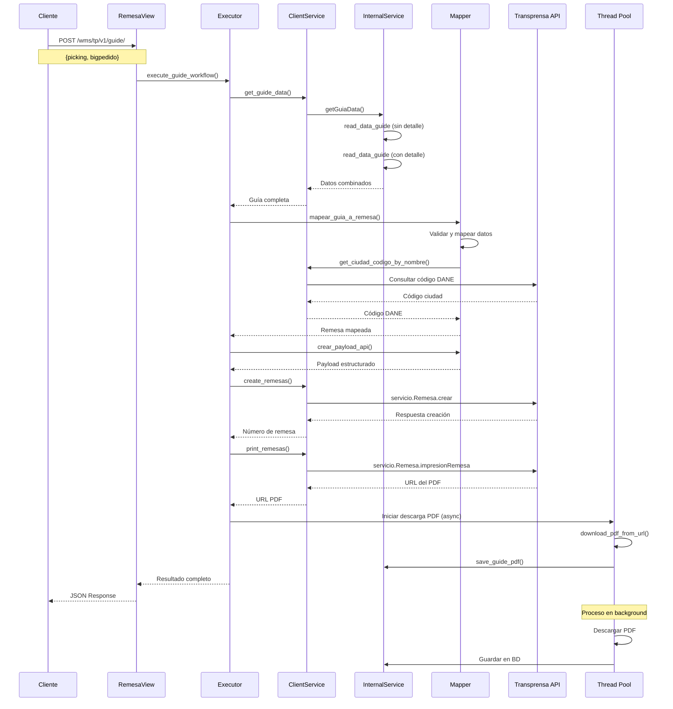
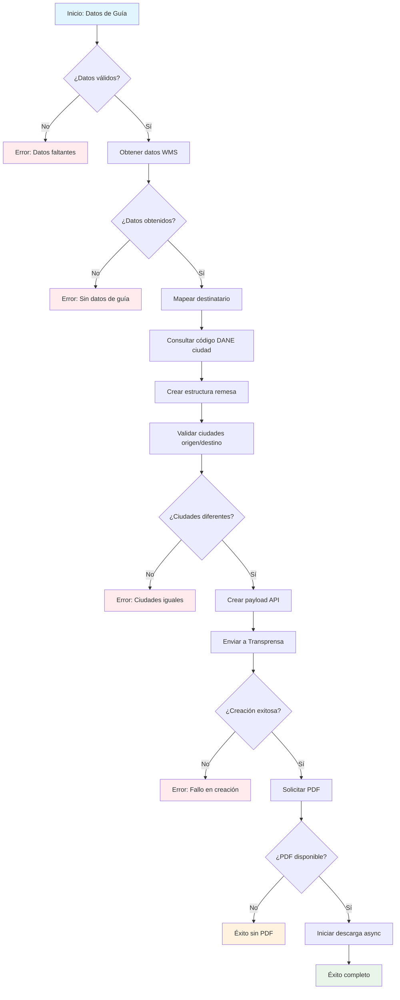
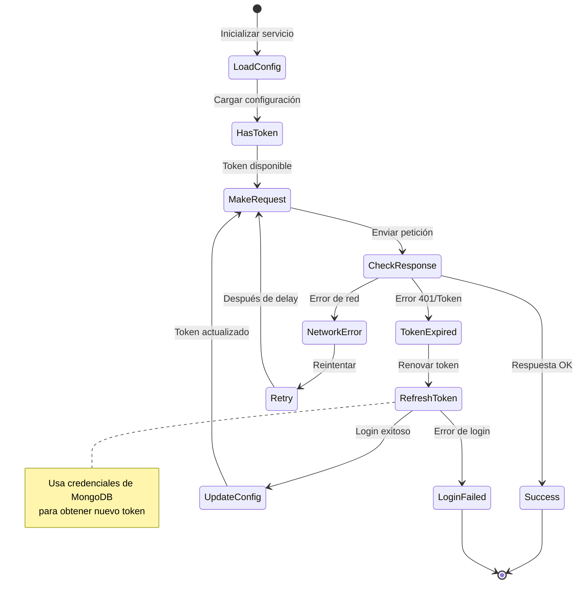
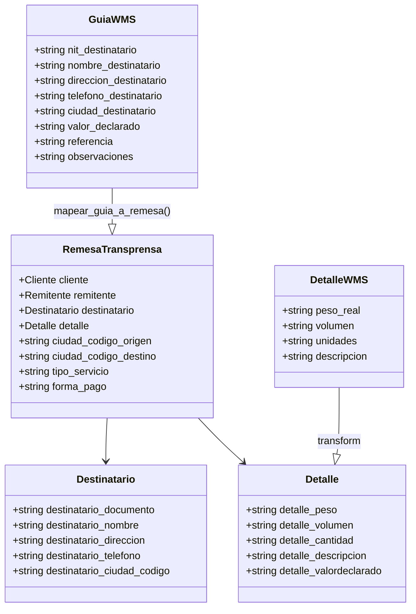

# Documentación del Proyecto Transprensa - WMS Copernico Integration

## 📋 Tabla de Contenidos
1. [Descripción General](#descripción-general)
2. [Flujo de Procesamiento de Guías](#flujo-de-procesamiento-de-guías)
3. [Componentes Principales](#componentes-principales)
4. [API Endpoints](#api-endpoints)
5. [Diagramas de Flujo](#diagramas-de-flujo)
6. [Mapeo de Datos](#mapeo-de-datos)

---

## 🎯 Descripción General

El proyecto **Transprensa** es un módulo de integración que facilita el procesamiento automatizado de guías de envío desde el sistema WMS Copérnico hacia el servicio de Transprensa. El sistema procesa guías, las mapea a remesas, las crea en Transprensa y maneja la descarga de PDFs de forma asíncrona.

### 🎨 Características Principales
- ✅ Procesamiento completo de guías en una sola solicitud
- ✅ Mapeo automático de datos WMS a formato Transprensa
- ✅ Validación de ciudades con códigos DANE
- ✅ Descarga asíncrona de PDFs
- ✅ Manejo de errores robusto
- ✅ Cache inteligente para consultas de ciudades

---

## 🔄 Flujo de Procesamiento de Guías

### Flujo Principal (Síncrono)



---

## 🧩 Componentes Principales

### 1. **RemesaView** (`transprensa/views/remesaView.py`)
- **Responsabilidad**: Endpoint HTTP para procesar guías
- **Endpoint**: `POST /wms/tp/v1/guide/`
- **Parámetros**: `picking`, `bigpedido`
- **Respuesta**: JSON con estado del procesamiento

### 2. **Execute Guide Workflow** (`transprensa/functions/create.py`)
- **Responsabilidad**: Orquestador principal del flujo
- **Funciones Clave**:
  - `execute_guide_workflow()`: Flujo principal
  - `download_pdf_from_url()`: Descarga PDFs
  - `_process_pdf_background()`: Procesamiento asíncrono

### 3. **Remesa Mapper** (`transprensa/functions/remesaMapper.py`)
- **Responsabilidad**: Transformación de datos WMS → Transprensa
- **Componentes**:
  - DataClasses para estructuras de datos
  - Funciones de mapeo y validación
  - Generación of payloads para API

### 4. **Client Service** (`transprensa/services/clientService.py`)
- **Responsabilidad**: Abstracción de servicios externos
- **Funciones**:
  - Consultas a WMS interno
  - Comunicación con Transprensa API
  - Cache de consultas de ciudades

### 5. **Transprensa Service** (`transprensa/services/transprensaService.py`)
- **Responsabilidad**: Cliente HTTP para Transprensa API
- **Características**:
  - Autenticación automática
  - Renovación de tokens
  - Reintentos automáticos

---

## 📡 API Endpoints

### Procesar Guía
```http
POST /wms/tp/v1/guide/
Content-Type: application/json

{
    "picking": "7746",
    "bigpedido": "PD-103888"
}
```

#### Respuesta Exitosa (200)
```json
{
    "success": true,
    "picking": "7746",
    "bigpedido": "PD-103888",
    "remesa_numero": "RM-123456",
    "msg": "Guía procesada exitosamente. PDF en procesamiento",
    "tiempo_ms": 2341,
    "pdf_en_background": true
}
```

#### Respuesta con Error (400/500)
```json
{
    "success": false,
    "picking": "7746",
    "bigpedido": "PD-103888",
    "remesa_numero": "",
    "mensaje": "La ciudad de origen y destino no pueden ser iguales",
    "tiempo_ms": 1205,
    "pdf_en_background": false
}
```

---

## 📊 Diagramas de Flujo

### Flujo de Validación y Mapeo



### Flujo de Autenticación Transprensa



---

## 🗂️ Mapeo de Datos

### Estructura de Datos WMS → Remesa Transprensa


